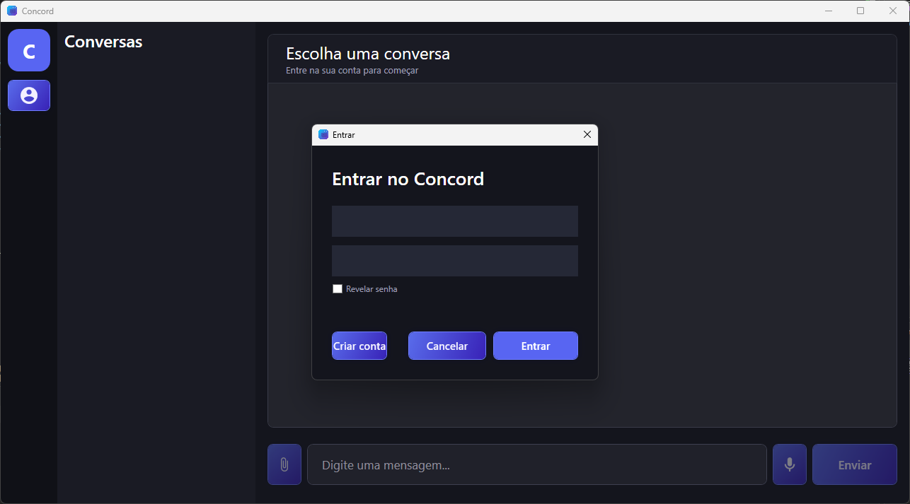
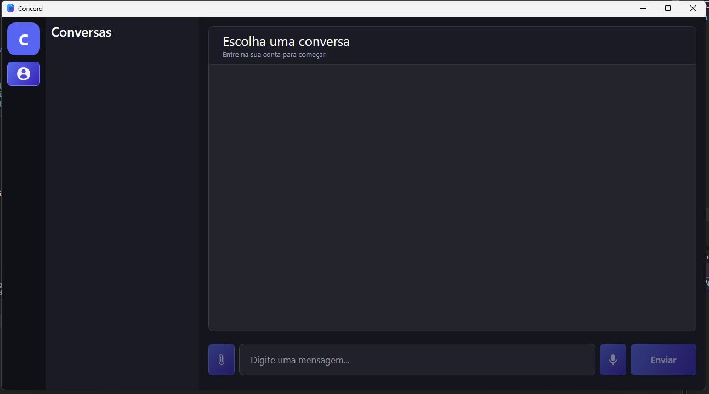
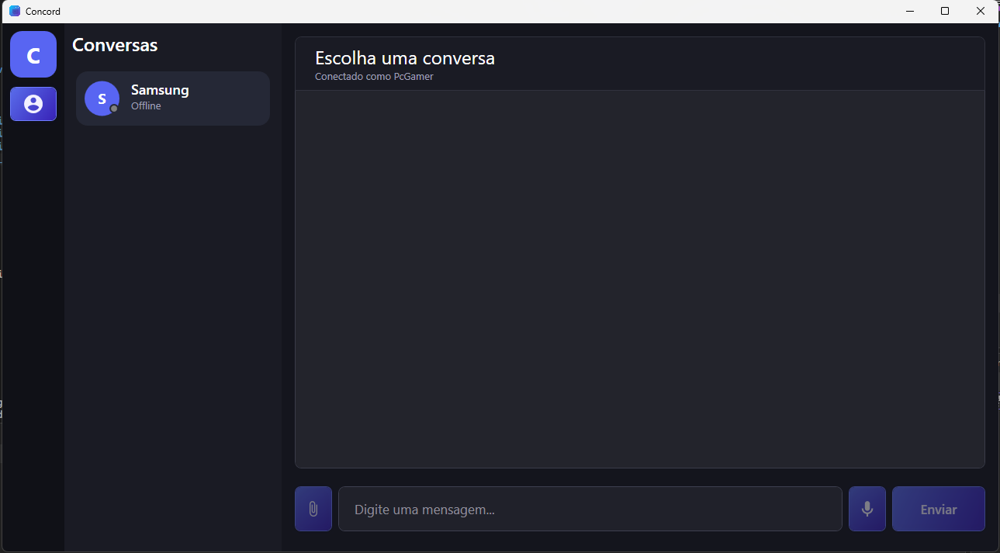
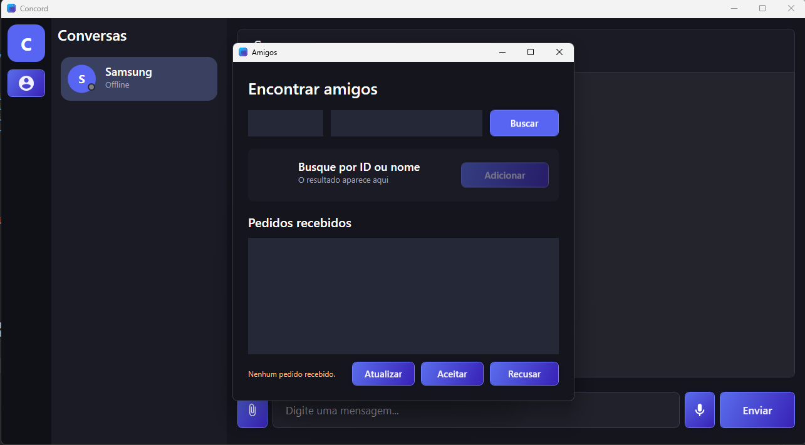
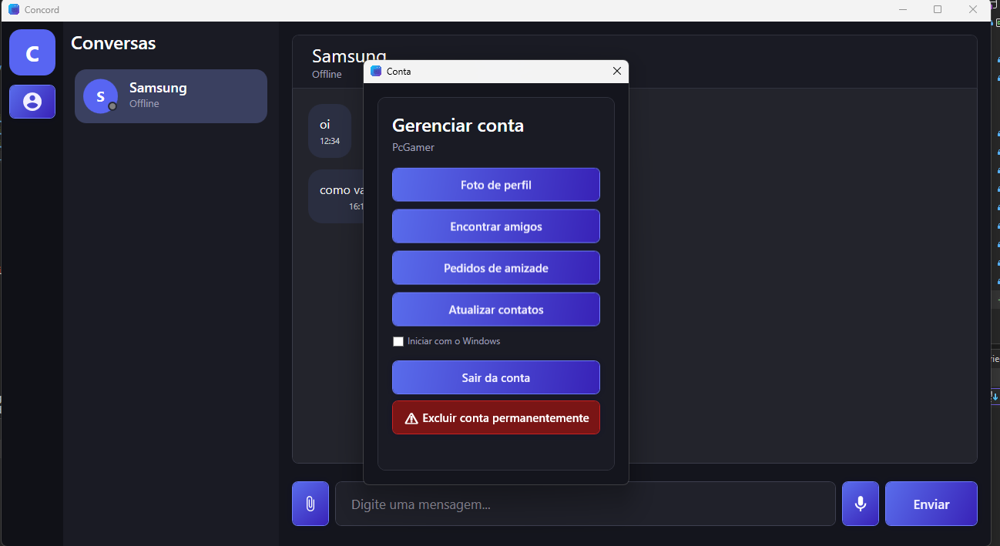

<div align="center">

# Concord!


<p>
  Aplicativo de chat desenvolvido em C# com autenticação, contatos, mensagens e backend em API.
</p>

<p>
  <p align="center">
    
    
    
    
</p>

<p align="center">
    
    
    
    
</p>
</p>

</div>

---

## 📌 Sobre o projeto

O **Concord** é um aplicativo de comunicação desenvolvido para reunir em um só sistema funcionalidades como cadastro, login, contatos e troca de mensagens.
O projeto foi pensado para demonstrar uma arquitetura moderna, com frontend desktop e backend em API.

## ✨ Funcionalidades

* Cadastro de usuários
* Login com autenticação
* Criptografia de senhas
* Lista de contatos
* Solicitação de amizade
* Envio e leitura de mensagens
* Integração com banco de dados
* Interface desktop com visual moderno

## 🛠️ Tecnologias utilizadas

<div align="left">

| Categoria | Tecnologia |
|-----------|------------|
| Linguagem | C# |
| Plataforma | .NET 10 |
| Desktop | WPF |
| Mobile | Kotlin + Jetpack Compose |
| Backend | ASP.NET Core |
| Banco de Dados | PostgreSQL |
| ORM | Entity Framework Core |
| Autenticação | JWT |
| Segurança | BCrypt |
| Comunicação | WebSockets |

</div>

## 📸 Capturas de tela

<p align="center">
  
  
  
  
  
</p>

## 🚀 Como executar

### Pré-requisitos

* .NET SDK instalado
* Visual Studio ou VS Code
* Banco de dados configurado
* Chave JWT definida
* String de conexão ajustada no `appsettings.json`

### Passos

```bash
git clone https://github.com/zyppyx/Concord---Definive-Edition.git
cd Concord---Definive-Edition
```

Depois:

1. Abra a solução no Visual Studio
2. Configure o `appsettings.json`
3. Execute as migrations, se necessário
4. Inicie a API
5. Execute o aplicativo desktop


## 🎯 Objetivo

O Concord é uma aplicação de chat completa desenvolvida em C#, construída utilizando uma arquitetura cliente-servidor moderna. O projeto reúne autenticação, comunicação em tempo real, persistência de dados e aplicações para diferentes plataformas em uma única solução.

## 🔐 Segurança

* Hash de senhas
* Autenticação por token
* Separação entre frontend e backend
* Controle de acesso por usuário


## 👨‍💻 Autor

Desenvolvido por **Danilo Tavares**.
