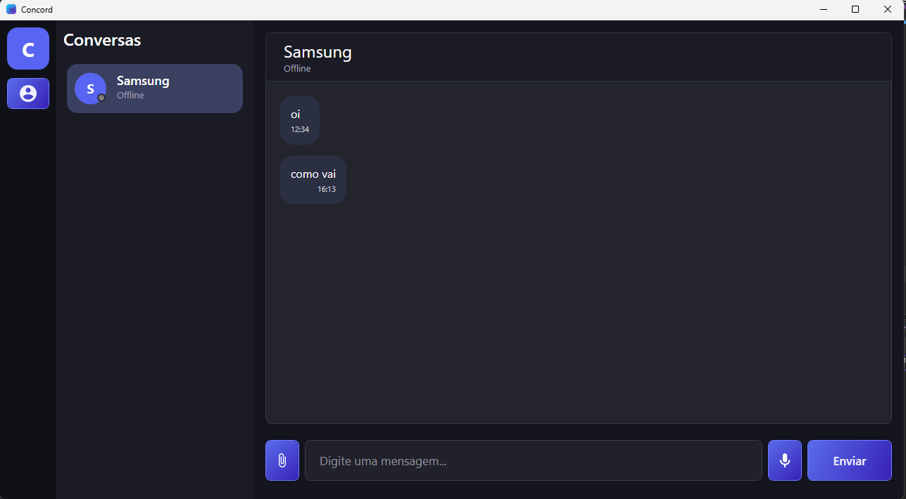
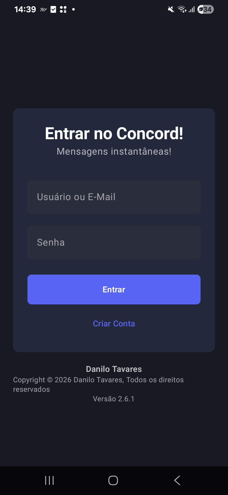
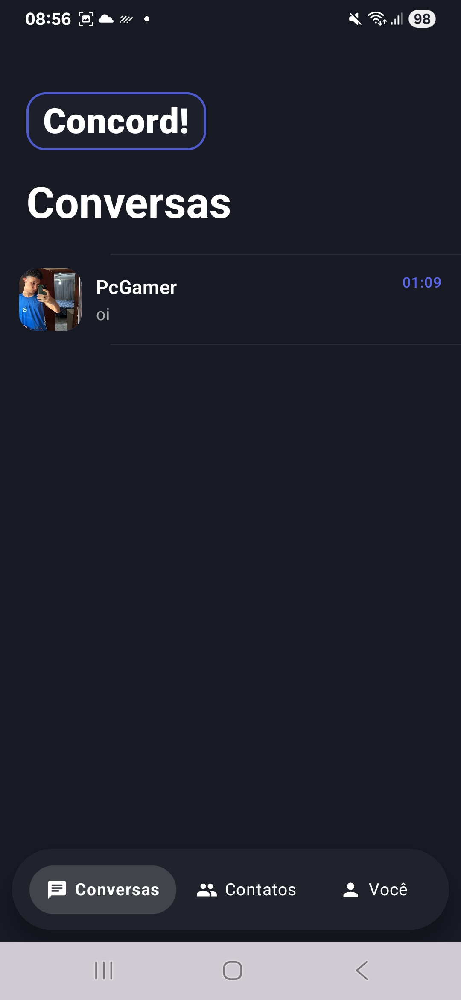
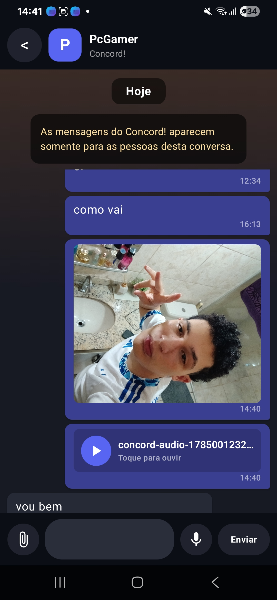

# Concord

Uma plataforma completa de comunicação composta por aplicações desktop, mobile e backend.

    
    
    
    

    
    
    
    

    
    
    
    

----------------------------------------------------

## 📖 Sobre o Projeto

O Concord é uma plataforma de comunicação desenvolvida para proporcionar uma experiência moderna e intuitiva em múltiplas plataformas. O projeto é composto por uma aplicação desktop desenvolvida em WPF, uma aplicação mobile desenvolvida em Kotlin com Jetpack Compose e uma API própria desenvolvida em ASP.NET Core.

Entre seus principais recursos estão a autenticação segura com JWT, comunicação em tempo real utilizando WebSockets, sistema de amizades, notificações, compartilhamento de imagens e gerenciamento completo de mensagens.

## 🖥️ Aplicação Desktop

    
    
    

    <b>Login</b> • <b>Tela Inicial</b> • <b>Chat em Tempo Real</b>

---

## 📱 Aplicação Mobile

    
    
    

    <b>Login</b> • <b>Tela Inicial</b> • <b>Chat em Tempo Real</b>

---

## 🏗️ Arquitetura do Projeto

| Componente | Tecnologias | Responsabilidade |
|------------|------------|------------|
| Concord.Desktop | WPF + .NET 10 | Interface desktop da aplicação. |
| Concord.API | ASP.NET Core + PostgreSQL + EF Core | Gerenciamento de usuários, mensagens, autenticação e comunicação em tempo real. |
| Concord.Android | Kotlin + Jetpack Compose | Interface mobile da aplicação. |

---

## ✨ Principais Funcionalidades

- Chat em tempo real utilizando WebSockets.
- Sistema de autenticação e autorização com JWT.
- Criptografia de senhas utilizando BCrypt.
- Sistema de amizades e gerenciamento de contatos.
- Compartilhamento de imagens no chat.
- Aplicação Desktop desenvolvida em WPF.
- Aplicação Mobile desenvolvida em Kotlin com Jetpack Compose.
- API REST desenvolvida em ASP.NET Core.
- Banco de dados PostgreSQL utilizando Entity Framework Core.
- Comunicação segura entre cliente e servidor.

## 🛠️ Tecnologias utilizadas

| Tecnologia | Utilização |
|------------|------------|
| .NET 10 | Aplicação Desktop |
| WPF | Interface Desktop |
| ASP.NET Core | Backend da aplicação |
| PostgreSQL | Banco de dados |
| Entity Framework Core | ORM |
| JWT | Autenticação |
| BCrypt | Criptografia das senhas |
| WebSockets | Comunicação em tempo real |
| Kotlin | Aplicação Android |
| Jetpack Compose | Interface Mobile |

---

## 📂 Estrutura do Repositório

| Pasta | Descrição |
|------|------|
| Concord.Desktop | Aplicação desktop desenvolvida em WPF (.NET 10) |
| Concord.API | API REST desenvolvida em ASP.NET Core |
| Concord.Android | Aplicação mobile desenvolvida em Kotlin + Jetpack Compose |
| assets | Logos e capturas de tela utilizadas no README |

---

## 🚀 Como Executar o Projeto

### Desktop

1. Abra a solução localizada em `Concord.Desktop`.
2. Configure a URL da API, caso necessário.
3. Execute o projeto pelo Visual Studio.

---

### API

1. Configure a string de conexão do PostgreSQL no `appsettings.json`.
2. Execute as migrations do Entity Framework Core.
3. Inicie a API utilizando o Visual Studio ou o .NET CLI.

---

### Android

1. Abra a pasta `Concord.Android` no Android Studio.
2. Configure a URL da API.
3. Execute o projeto em um dispositivo físico ou emulador Android.

---

## 👨‍💻 Desenvolvedor

Desenvolvido por Danilo Tavares.

- Desktop: WPF + .NET 10
- Backend: ASP.NET Core + PostgreSQL
- Mobile: Kotlin + Jetpack Compose

